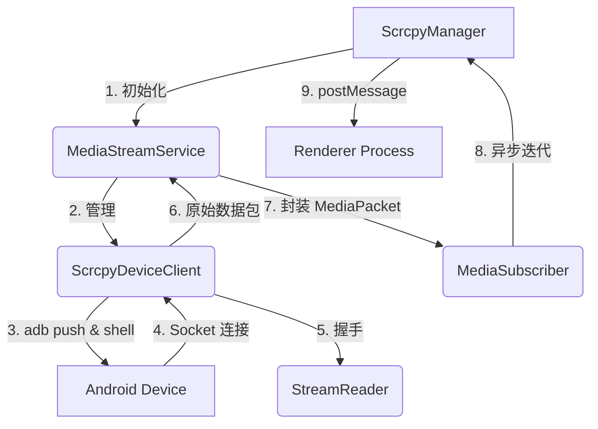

# Scrcpy 4.0 Node/Electron 实现方案

本项目集成了一套基于 **scrcpy 4.0 协议** 的完整投屏与控制方案。该方案允许 Electron 应用通过 ADB 直接连接 Android 设备，实现低延迟、高性能的音视频流传输及远程操控。

## 1. 核心流程与架构

项目的核心架构遵循 **"底层 Client -> 高层 Service -> 订阅者"** 的三层结构。

### 架构流程图 (Mermaid)

### 详细步骤与方法映射

#### A. 准备与部署 (Deployment)
- **入口方法**：`ScrcpyDeviceClient.start()`
- **Server 部署**：调用 `adb.push()` 将 jar 包传输至设备。
- **启动命令**：`ScrcpyDeviceClient.spawnServer()` 构造复杂的 `app_process` 命令并通过 `device.shell()` 启动。

#### B. 建立连接与握手 (Handshake)
- **Socket 连接**：`ScrcpyDeviceClient.connectSockets()`。
  - 使用 `device.openLocal()` 连接到 `localabstract:scrcpy_0000000a`。
- **精确读取**：使用 `StreamReader.readExact(n)` 保证从流中读取固定字节。
- **协议协商**：`ScrcpyDeviceClient.handshake()`。
  - 解析 dummy byte、设备名、编解码器 ID。
  - **关键解析**：使用 `parseFrameHeader()` 解析视频 Session 信息（获取初始分辨率）。

#### C. 数据流转 (Streaming)
- **读取循环**：`ScrcpyDeviceClient.workerLoop()`。
  - 持续从各 Socket 读取 12 字节头部。
- **数据分发**：
  - `ScrcpyDeviceClient` 发出 `video` / `audio` 事件。
  - `MediaStreamService` 监听事件并将其封装为 `MediaPacket`。
  - 调用 `MediaStreamService.broadcast()` 将数据推送至所有 `MediaSubscriber`。
- **缓冲管理**：`MediaSubscriber.push()`。
  - 实现了一个固定长度的队列，当渲染端处理慢时，会自动丢弃旧的非关键帧数据以保证实时性。

#### D. 交互控制 (Control)
- **指令发送**：`MediaStreamService.sendControlMessage(msg)`。
- **序列化**：调用 `protocol/control.ts` 中的 `serializeControlMessage()` 将 JSON 指令转为二进制。
- **执行**：通过 `controlSocket.write()` 发送至设备。

## 2. 技术细节

### scrcpy 4.0 协议特性
- **SCID**：支持多实例区分，通过 SCID 可以在同一台设备上运行多个独立的服务。
- **音视频分离**：视频与音频走独立的 Socket 通道，互不干扰，支持不同的编解码器组合。
- **Annex B 格式**：视频流直接输出原始的 Annex B 格式，包含了起始码（00 00 00 01），非常适合 WebCodecs 直接解码。

### 性能优化
1. **WebCodecs 解码**：在渲染进程中使用 `VideoDecoder` 进行硬件加速解码。相比传统的 WASM 解码或渲染，极大地降低了 CPU 占用和延迟。
2. **MessagePort 桥接**：主进程与渲染进程之间通过 `MessagePortMain` 建立直接通信管道。视频数据包直接通过该管道传输，避免了频繁的 IPC 序列化开销。
3. **关键帧管理**：前端实现了 `pendingConfig` 机制，确保解码器在配置后能立即获得 SPS/PPS 信息，并从第一个关键帧开始顺畅渲染。

### 代码结构 (`src/scrcpy/`)
- `core/`: 核心逻辑实现。
  - `device-client.ts`: 底层 ADB 连接与 scrcpy-server 交互 (`ScrcpyDeviceClient`)。
  - `media-service.ts`: 高层流管理与分发服务 (`MediaStreamService`)。
  - `media-subscriber.ts`: 订阅者逻辑与数据包缓冲 (`MediaSubscriber`)。
  - `stream-reader.ts`: 辅助 Socket 流读取。
- `protocol/`: 协议定义。
  - `constants.ts`: 各种标志位、Codec ID 和常量。
  - `frame.ts`: 流数据包解析。
  - `control.ts`: 控制指令序列化。
  - `device.ts`: 设备反馈消息解析。

## 3. 开发与调试

### 类名变更记录
为了提高代码的可读性，我们对核心类进行了重命名：
- `ScrcpyV4Backend` -> `ScrcpyDeviceClient`
- `ScrcpyV4Service` -> `MediaStreamService`

### VSCode 配置
项目已针对 TypeScript 5.0+ 进行了优化，`tsconfig.json` 采用 `moduleResolution: "Bundler"`，解决了路径解析和 Deprecation 警告。

### 日志查看
- **主进程**: 观察 `[Scrcpy Manager]` 开头的日志，查看数据包发送频率和大小。
- **渲染进程**: 观察 `[Renderer]` 开头的日志，确认解码器状态 (`First frame decoded!`)。

## 4. 依赖项
- `@u4/adbkit`: ADB 通信。
- `ws`, `express`: 支持 Web 桥接。
- `fs-extra`: 资源文件管理。
